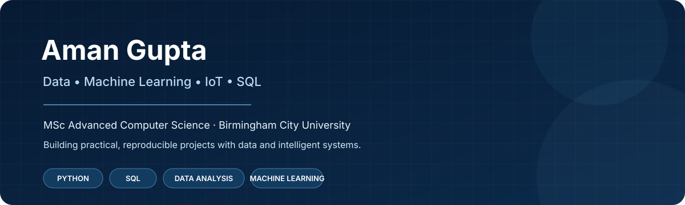

**Aman Gupta**  
Computer Science · Data Analytics · Machine Learning · IoT Research

[Original MSc repository](https://github.com/kaashgarg19/iot-human-movement-prediction-msc) · [Research repository](https://github.com/kaashgarg19/robust-iot-human-movement-prediction) · [Research CV](https://github.com/kaashgarg19/kaashgarg19/blob/main/Aman_Gupta_CV.pdf) · [Portfolio website](https://kaashgarg19.github.io/kaashgarg19/) · [ORCID](https://orcid.org/0009-0007-4112-9993) · [LinkedIn](https://www.linkedin.com/in/amangupta1911)

## About

I am a Computer Science graduate with an **MSc in Advanced Computer Science (Distinction)** from Birmingham City University.

My work is mainly around **data analytics, machine learning, IoT sensing, SQL and practical software development**. I like working with real datasets, understanding what the data is showing, and building analysis that can be followed by someone else.

My MSc dissertation explored environmental IoT sensor data for human-movement prediction. I am now revisiting that work and extending the analysis to look at rare movement events and what happens when the data changes over time or between devices.

## Research

### Human movement prediction from environmental IoT sensors

**Original MSc dissertation:** *Intelligent System to Predict Human Movement near IoT Devices*

The research repository keeps the **2021 MSc work separate from the later analysis**. It documents the dataset, original implementation, reconstructed historical results, current experiments, notebooks, source code and limitations.

**Current research question**

> How reliably can machine-learning models predict human movement from environmental IoT sensor data when the data distribution changes across time and sensing devices?

**Areas I am exploring**
- Rare-event prediction and class imbalance
- Temporal evaluation and generalisation
- Device-level distribution shift
- Feature ablation and sensitivity
- Decision-threshold analysis
- Reproducible machine-learning workflows

[Original MSc repository](https://github.com/kaashgarg19/iot-human-movement-prediction-msc) · [Explore the current research repository](https://github.com/kaashgarg19/robust-iot-human-movement-prediction) · [Download Research CV](https://github.com/kaashgarg19/kaashgarg19/blob/main/Aman_Gupta_CV.pdf)

## Selected projects

| Project | Focus |
| --- | --- |
| [IoT Human Movement Prediction — Research Extension](https://github.com/kaashgarg19/robust-iot-human-movement-prediction) | IoT sensor data, Python, machine learning and research evaluation |
| [Original MSc Dissertation](https://github.com/kaashgarg19/iot-human-movement-prediction-msc) | Original MSc implementation and dissertation |
| [Bike Sales SQL Analysis](https://github.com/kaashgarg19/kaashgarg19/tree/main/sql) | SQL joins, aggregation, revenue calculations and customer analysis |
| [Amazon Prime Data Analysis](https://github.com/kaashgarg19/AmazonPrime_Data_Analysis_EDA) | Python, pandas, visualisation and exploratory data analysis |
| [Stock Market Portfolio Analysis](https://github.com/kaashgarg19/STOCK_MARKET_PORTFOLIO_OPTIMIZATION) | Historical prices, returns, volatility and portfolio calculations |
| [Data Science Coursework 1](https://github.com/kaashgarg19/Data-Science-CourseWork) | Regression and practical Python data analysis |
| [Opportunity Dataset Team Project](https://github.com/kaashgarg19/Opportunity-Dataset-Team-Project-) | Team-based data preparation, quality checks, visualisation and reporting |

## Technical skills

**Programming & data**  
Python · SQL · MySQL · Pandas · NumPy · Scikit-learn

**Analytics & visualisation**  
Power BI · Excel · Jupyter · Matplotlib · Seaborn · Exploratory Data Analysis

**Machine learning**  
Classification · Regression · Model evaluation · Imbalanced-data evaluation · Feature analysis · Predictive modelling

**Development**  
JavaScript · React Native · Angular · Git · GitHub

## Education

**MSc Advanced Computer Science — Distinction**  
Birmingham City University, UK · 2020–2021

**BTech Computer Science Engineering**  
Maharshi Dayanand University, India · 2011–2015

## Professional experience

**Concentrix — Advisor I, Customer Service**  
Nov 2025–Present

Customer support work involving case review, process adherence, escalation handling and accurate case documentation.

**KFC UKI — Team Member / Trainee Team Leader**  
Sep 2022–Nov 2024

Restaurant operations, customer service and team coordination in a high-volume environment, with progression to Trainee Team Leader.

## Portfolio links

**Website:** https://kaashgarg19.github.io/kaashgarg19/  
**Research CV:** https://github.com/kaashgarg19/kaashgarg19/blob/main/Aman_Gupta_CV.pdf  
**ORCID:** https://orcid.org/0009-0007-4112-9993  
**LinkedIn:** https://www.linkedin.com/in/amangupta1911  
**GitHub:** https://github.com/kaashgarg19

## How I document my work

I try to keep each project clear about what it is and what it is not.

- Original MSc work is kept distinct from later research analysis.
- Team projects are labelled as team projects.
- Coursework is presented as coursework rather than as professional research.
- Dataset sources and limitations are documented where relevant.
- Results are only highlighted when they can be traced to project files or documented analysis.
- Research claims are kept within the evidence available from the current dataset and experiments.
